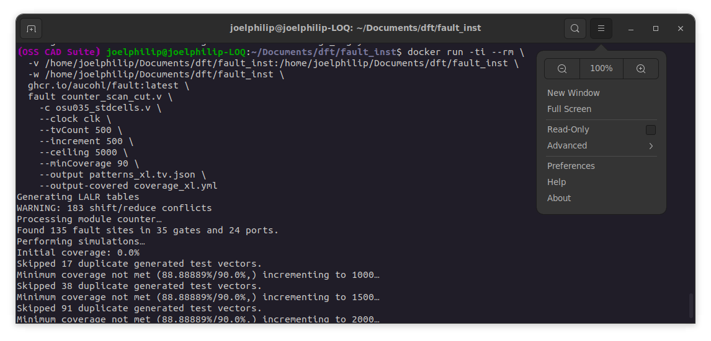
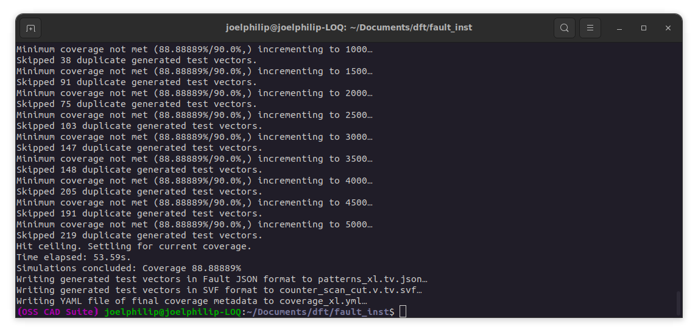
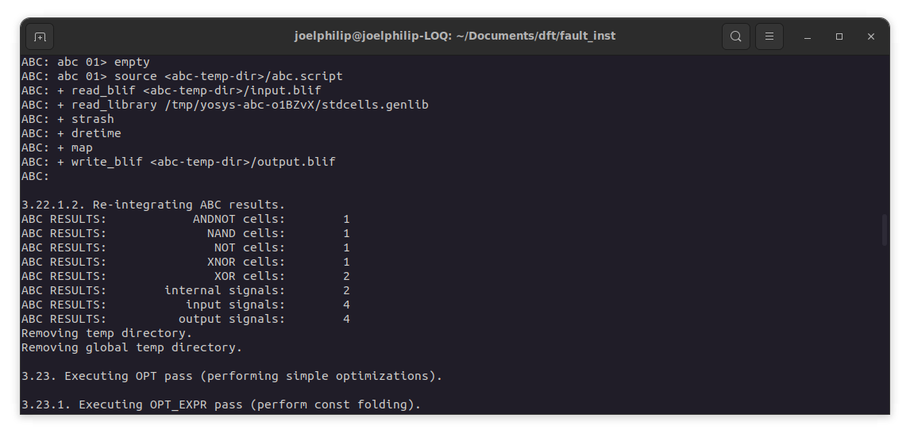
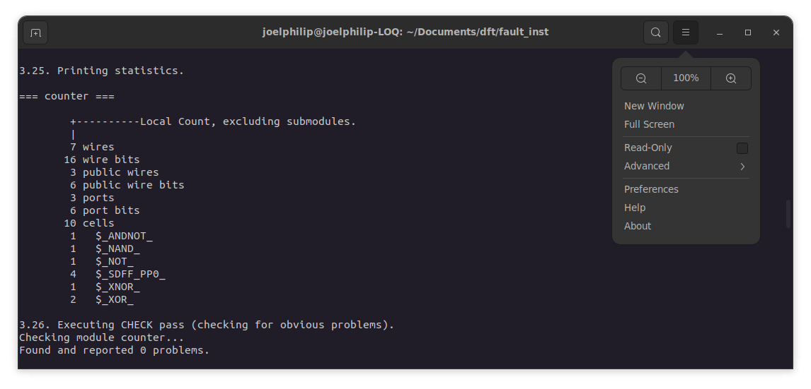

# Scan Insertion and ATPG using Fault Open Source Tool

This project demonstrates the Design for Testability (DFT), Automatic Test Pattern Generation (ATPG), Fault Coverage, and Test Compaction flow using the **Fault** open-source tool.

The workflow focuses on testability analysis of a counter, performing scan chain insertion, cutting scan loops, and generating test patterns.

## Prerequisites

- **Docker**: This guide uses the `fault` tool via a Docker container. Ensure Docker is installed and running.
- **Fault Docker Image**: `ghcr.io/aucohl/fault:latest`

## Technology Library & References

- **Technology Library Used**: [VLSI Technology osu035](https://www.vlsitechnology.org/html/libraries04.html)
- **Library Files in Repo**: `osu035_stdcells.lib` (Liberty format), `osu035_stdcells.v` (Verilog format) (See: [University of Oklahoma / Oklahoma State University Digital VLSI](https://github.com/AUCOHL/Fault/tree/main/Tech/osu035))
- **Fault Documentation**: [Fault Read the Docs](https://fault.readthedocs.io/en/latest/usage.html)

## Workflow Steps

### 1. Scan Insertion (FAULT chain)

This step performs scan Flip-Flop replacement and insertion to create a scan chain.


**Command:**
```bash
docker run -ti --rm \
  -v $(pwd):/workspace \
  -w /workspace \
  ghcr.io/aucohl/fault:latest \
  fault chain counter_trial.v \
    --clock clk \
    --reset rst \
    --liberty osu035_stdcells.lib \
    -o counter_scan1.v \
    --sout sout
```


**Output:** `counter_scan1.v`

### 2. Scan Cut (Break Scan Loops)

It is necessary to perform a "cut" in the Fault flow to break scan loops.

**Command:**
```bash
docker run -ti --rm \
  -v $(pwd):/workspace \
  -w /workspace \
  ghcr.io/aucohl/fault:latest \
  fault cut counter_scan1.v \
    -o counter_scan_cut.v
```

**Output:** `counter_scan_cut.v`

### 3. ATPG – Large Random Search

This step performs Automatic Test Pattern Generation to achieve high fault coverage (aiming for e.g., >90%).




**Command:**
```bash
docker run -ti --rm \
  -v $(pwd):/workspace \
  -w /workspace \
  ghcr.io/aucohl/fault:latest \
  fault counter_scan_cut.v \
    -c osu035_stdcells.v \
    --clock clk \
    --tvCount 500 \
    --increment 500 \
    --ceiling 5000 \
    --minCoverage 90 \
    --output patterns_xl.tv.json \
    --output-covered coverage_xl.yml
```

**Output:**
- `patterns_xl.tv.json`: Generated test patterns.
- `coverage_xl.yml`: Coverage report.

## Visualization



